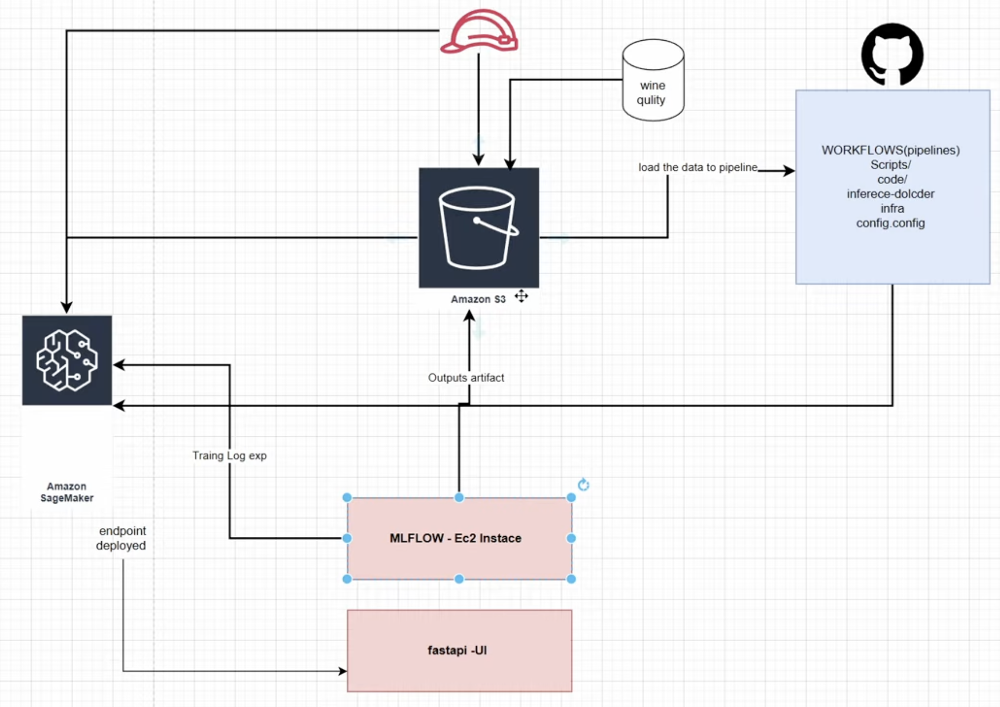
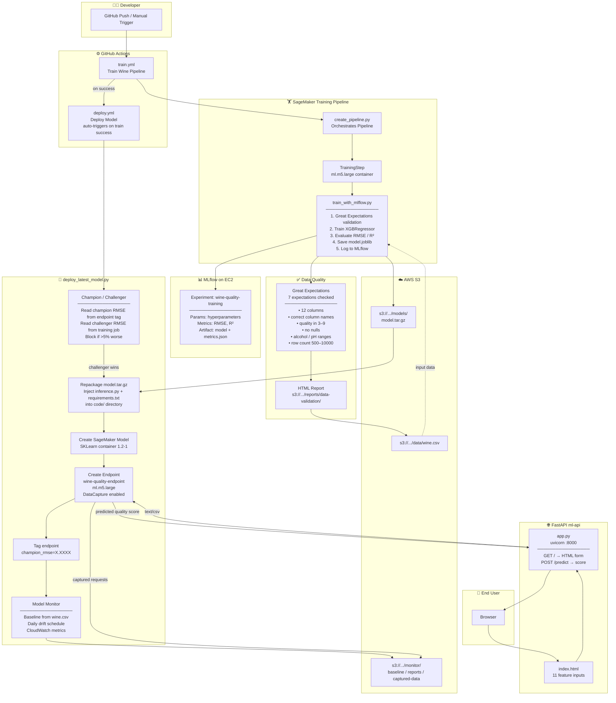

# MLOps Project

- **SageMaker** — training pipeline and providing endpoint
- **MLflow** — experiments tracking and model registry
- **Great Expectations** — data validation
- **SageMaker Monitor** — data drift detection, Champion/Challenger model promotion
- **FastAPI** — web API for inference
- **Terraform** — infrastructure: EC2 for MLflow server, S3 for dataset and model artifacts, IAM roles

MLFlow version 2.21

starting on EC2

mlflow server \
  --host 0.0.0.0 \
  --port 5000 \
  --backend-store-uri sqlite:///mlflow.db \
  --default-artifact-root s3://{{AWS_S3_BUCKET}}/mlflow/

To start FastApi server with Sagemaker endpoint backend

cd ml-api
pip install -r requirements.txt

# Set AWS credentials (needs sagemaker:InvokeEndpoint permission)
set region, aws access key and secret key

uvicorn app:app --host 0.0.0.0 --port 8000
